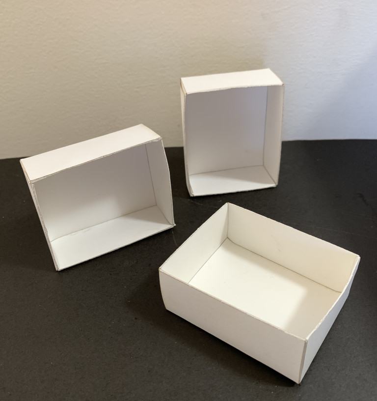
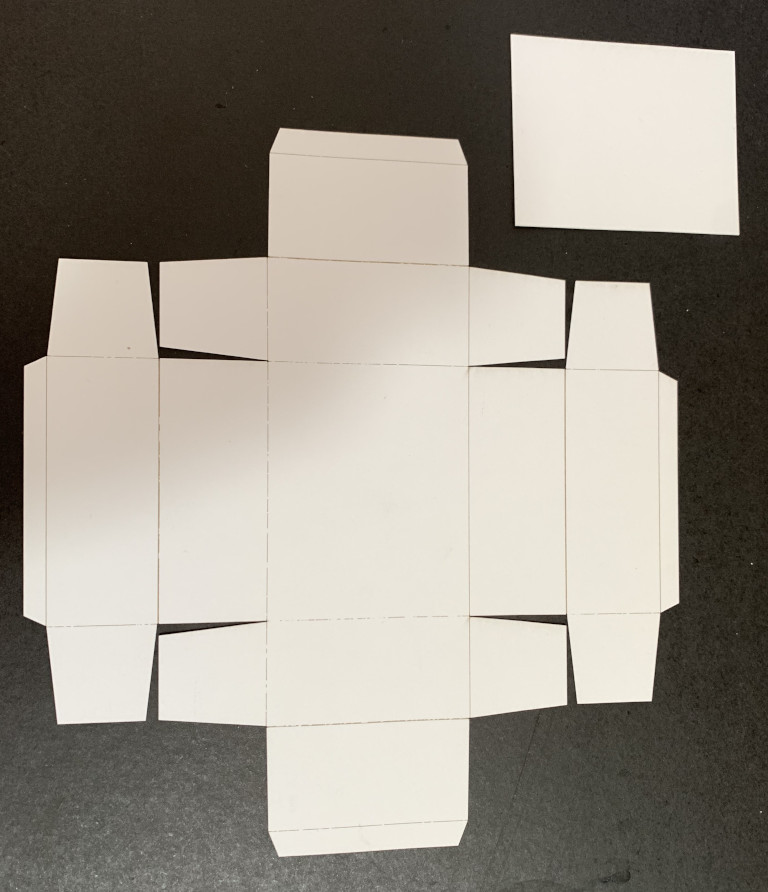
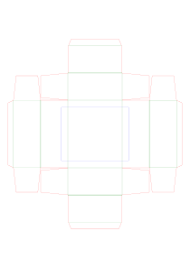

**Diecut Tray**

Simple python to generate a tray die‑cut SVG file with double-folds for sides, flaps and base insert, intended for cutting cardstock on a laser cutting machine.
Original intent was to make some small but robust trays from thin card for holding rocks and mineral specimins. I could not find a good free die-cut pattern online.
The base insert (blue box in the resulting SVG) should be repositioned so as not to overlap with the rest of the die cut in your laser cutting software.

